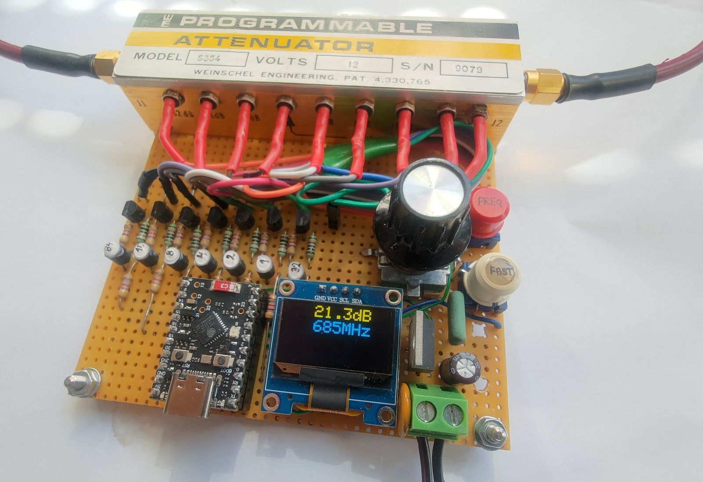

# attenuator

Controller for 127dB Weinschel attenuator or alike.

Input:
- calibration data from `s1p` files. Name pattern: `<min>-<max>-<att>.s1p` , eg. `0-1000-5.s1p` for 1000 calibration points between 0-1000MHz measured at 5dB nominal setting.
- requested attenuation
- frequency of interest

Output:
- attenuator control for the closest requested attenuation
- information about minimum and maximum attenuation possible for the frequency

 